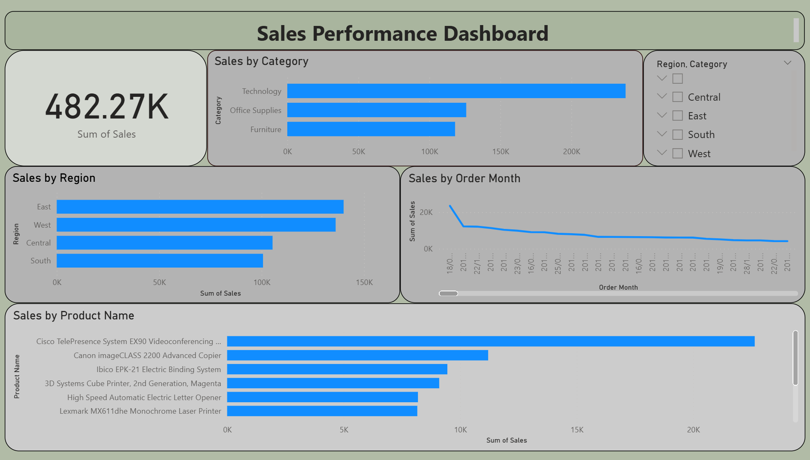

📊 Sales Performance Dashboard
📌 Objective

Analyze sales data to identify trends, top-performing products, and regional performance.

🛠 Tools Used
SQL
Excel
Power BI

📊 Key Analysis
Sales by region
Sales by category
Monthly sales trend
Top 10 products

📈 Insights
Technology category generated highest sales
East region contributed most revenue
Sales show a declining trend over time
📷 Dashboard Preview

📁 Files Included
Dataset (CSV)
SQL queries
Power BI dashboard screenshot
